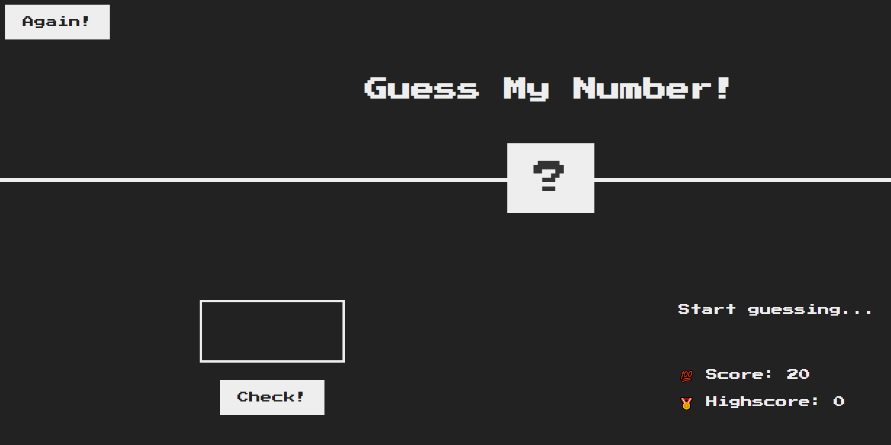

# Project-1--Guess-My-Number


# Number Guessing Game

The Number Guessing Game is a simple web application built with HTML, CSS, and JavaScript. The game challenges players to guess a randomly generated secret number between 1 and 20. Players have 20 chances to guess the correct number and can track their scores as they play.

## Features

- Guess the secret number within 20 attempts.
- Receive feedback on whether your guess is too high or too low.
- Keep track of your score and highscore.
- Reset the game to start guessing again.

## How to Play

1. Enter your guess in the input field and click the "Check" button.
2. Receive feedback on your guess and continue guessing.
3. Try to guess the correct number within 20 attempts to win the game.
4. Your highscore will be updated if you beat your previous best score.

## Screenshots




## Try it Out

You can try out the game by [visiting this link](#).

## Installation

To run the game locally, you can clone the repository and open the `index.html` file in your web browser.

```bash
git clone https://github.com/yourusername/number-guessing-game.git
