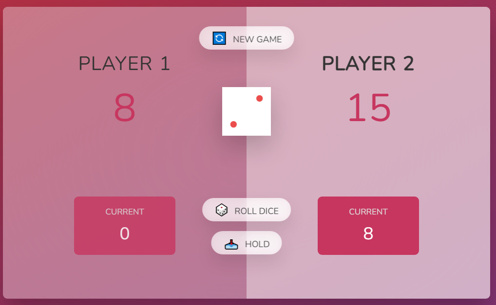

# Project-1--Guess-My-Number

# Dice Game

This is a simple dice game application built with HTML, CSS, and JavaScript. The game allows two players to take turns rolling a dice and accumulating points. The goal is to be the first player to reach a specified score (e.g., 100) and become the winner.

## Features

- Roll the dice to accumulate points for your turn.
- Hold your current score to add it to your total score.
- Avoid rolling a 1, as it switches the turn to the other player.
- The first player to reach the specified winning score is declared the winner.

## How to Play

1. Click the "Roll Dice" button to roll the dice.
2. Keep rolling to accumulate points, but don't roll a 1.
3. Click the "Hold" button to add your current points to your total score.
4. Be the first player to reach the winning score to win the game.
